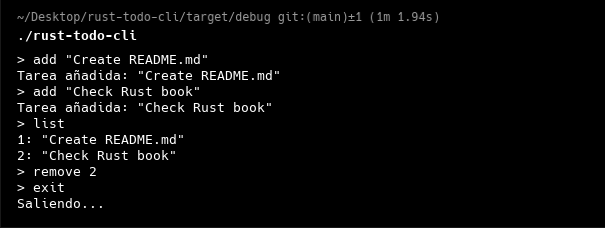

# 🦀 Rust To-Do CLI

**Una herramienta minimalista de línea de comandos para gestionar tareas, escrita en Rust con seguridad y rendimiento.**



## 🚀 Características principales
- ✅ Añadir tareas con descripciones flexibles
- 📋 Listar todas las tareas numeradas
- ❌ Eliminar tareas por índice
- 💾 Persistencia automática en archivo `todo.txt`
- 🖥️ Interfaz intuitiva para terminal

## 📦 Instalación

1. Clona el repositorio:
```bash
git clone https://github.com/Tsmrain/rust-todo-cli.git
 
cd rust-todo-cli
cargo run


./rust-todo-cli
> add "Create README.md"
Tarea añadida: "Create README.md"
> add "Check Rust book"
Tarea añadida: "Check Rust book"
> list
1: "Create README.md"
2: "Check Rust book"
> remove 2
> exit
Saliendo...